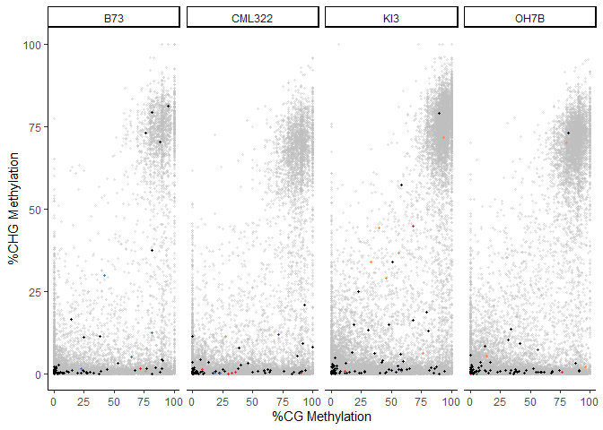

fig3_methylation
================
Chandler Sutherland
2024-01-26

Author: Chandler Sutherland Copyright (c) Chandler Sutherland Email:
<chandlersutherland@berkeley.edu>

Goal: Generate methylation figures shown in Fig3 and Supplemental Figure
4

``` r
library(ggplot2)
library(tidyverse)
library(ggsignif)
library(ggpubr)
library(introdataviz)
library(pheatmap)
library(patchwork)
```

Import all gene methylation data, clean

``` r
CpG <- read.csv('//wsl.localhost//Ubuntu//home//chandlersutherland//e16_scratch//CpG_meth.tsv', sep='\t') 
CHG <- read.csv('//wsl.localhost//Ubuntu//home//chandlersutherland//e16_scratch//CHG_meth.tsv', sep='\t') 
CHH <- read.csv('//wsl.localhost//Ubuntu//home//chandlersutherland//e16_scratch//CHH_meth.tsv', sep='\t') 

#calculate average per gene %methylation weighted by count for each context 
CpG_group <- CpG %>%
  group_by(name, accession) %>% 
  summarize(meth_percentage=weighted.mean(meth_percentage, count/sum(count))) %>%
  mutate(context='CpG')
```

    ## `summarise()` has grouped output by 'name'. You can override using the
    ## `.groups` argument.

``` r
CHG_group <- CHG %>%
  group_by(name, accession) %>% 
  summarize(meth_percentage=weighted.mean(meth_percentage, count/sum(count))) %>%
  mutate(context='CHG')
```

    ## `summarise()` has grouped output by 'name'. You can override using the
    ## `.groups` argument.

``` r
CHH_group <- CHH %>%
  group_by(name, accession) %>% 
  summarize(meth_percentage=weighted.mean(meth_percentage, count/sum(count))) %>%
  mutate(context='CHH')
```

    ## `summarise()` has grouped output by 'name'. You can override using the
    ## `.groups` argument.

``` r
#combine to one table 
methylation <- rbind(CpG_group, CHG_group, CHH_group)

#write out 
write.csv(methylation, "C:\\Users\\chand\\Box Sync\\Krasileva_Lab\\Research\\chandler\\Krasileva Lab\\E16\\intermediate_data\\percent_methylation.csv")
```

``` r
#subset to just NLRs, add clean clade info 
gene_table <- read.csv('Maize_NLRome_GeneTable.txt', sep='\t') %>% subset(select=c('Gene', 'Ecotype', 'HV', 'Clade'))
gene_table$Ecotype <- gene_table$Ecotype %>% toupper()
gene_table$Gene <- gene_table$Gene %>% 
  str_replace('ZM', 'Zm') %>% 
  str_replace('AB', 'ab') %>% 
  str_replace("EB", 'eb') %>% 
  str_replace('_P001', '')

#read in subpopulation info 
subpopulations <- read_table('//wsl.localhost//Ubuntu//home//chandlersutherland//e16//download//nam_genome_info.txt', col_names=c('Assembly', 'Grin', 'accession_id', 'source', 'cross_reference', 'subpopulation', 'stock'), skip=1) %>% separate(Assembly, sep='-', into=c(NA, 'accession', NA, NA, NA))
```

    ## 
    ## ── Column specification ────────────────────────────────────────────────────────
    ## cols(
    ##   Assembly = col_character(),
    ##   Grin = col_character(),
    ##   accession_id = col_double(),
    ##   source = col_character(),
    ##   cross_reference = col_character(),
    ##   subpopulation = col_character(),
    ##   stock = col_character()
    ## )

    ## Warning: 25 parsing failures.
    ## row col  expected    actual                                                                                    file
    ##   1  -- 7 columns 8 columns '//wsl.localhost//Ubuntu//home//chandlersutherland//e16//download//nam_genome_info.txt'
    ##   2  -- 7 columns 8 columns '//wsl.localhost//Ubuntu//home//chandlersutherland//e16//download//nam_genome_info.txt'
    ##   3  -- 7 columns 8 columns '//wsl.localhost//Ubuntu//home//chandlersutherland//e16//download//nam_genome_info.txt'
    ##   4  -- 7 columns 8 columns '//wsl.localhost//Ubuntu//home//chandlersutherland//e16//download//nam_genome_info.txt'
    ##   5  -- 7 columns 8 columns '//wsl.localhost//Ubuntu//home//chandlersutherland//e16//download//nam_genome_info.txt'
    ## ... ... ......... ......... .......................................................................................
    ## See problems(...) for more details.

``` r
subpopulations$accession <- subpopulations$accession %>% toupper()
subpopulations <- subpopulations %>% subset(select=c('accession', 'subpopulation'))
subpopulations[nrow(subpopulations) + 1,] = list('B73', 'Stiff stalk')
subpopulations <- subpopulations %>% mutate(subpopulation =recode(subpopulation, 'Temporate/tropical'='Temporate/Tropical'))%>% 
  mutate(subpopulation =recode(subpopulation, 'Temporate/Tropical'='Mixed', 'Non-stiff-stalk'='Non-stiff stalk', 'Sweet'='Sweetcorn'))
subpopulations$subpopulation <- factor(subpopulations$subpopulation, levels=c('Stiff stalk', 'Non-stiff stalk', 'Mixed', 'Popcorn', 'Sweetcorn', 'Tropical'))

#subset, cleanup 
nlr_meth <- methylation %>% 
  filter(name %in% gene_table$Gene) %>% 
  merge(gene_table, by.x = 'name', by.y= 'Gene') %>%
  mutate(Clade_adj=recode(Clade, 'Int3480_75_130_L_68'='Int3480', 
                          'Int4787_129_172_L_83'='RppM-like', 
                          'Int6329_131_253_L_122_209_L_80_142_L_61'='RppC-like', 'Int6329_131_253_L_122_209_R_35_43_R_23'='RppC-like',
                          'Int6329_131_253_L_122_209_L_80_142_R_18'='RppC-like',
                          'Int6648_150_178_L_128_144_R_93'='Rp1-like')) %>% merge(subpopulations)

nlr_meth <- nlr_meth %>% mutate(HV=case_match(HV, 0 ~ 'non-hv', 
                                  1 ~ 'hv'))

nlr_meth$HV <- factor(nlr_meth$HV, levels=c('non-hv', 'hv'))


write.csv(nlr_meth, "C:\\Users\\chand\\Box Sync\\Krasileva_Lab\\Research\\chandler\\Krasileva Lab\\E16\\intermediate_data\\nlr_methylation.csv")
```

Test plot B73 all genes and then highlight NLRs

``` r
B73 <- methylation %>%
  unique() %>% 
  pivot_wider(names_from=context, values_from=meth_percentage) %>%
  filter(accession=='B73')

B73_nlr <- nlr_meth %>%
  unique() %>% 
  pivot_wider(names_from=context, values_from=meth_percentage) %>%
  filter(accession=='B73') %>% 
  mutate(Clade_adj2=recode(Clade_adj, 'Int3480'='Int3480', 
                              'RppM-like'='RppM-like', 
                              'RppC-like'='RppC-like', 
                              'Rp1-like'='Rp1-like', 
                            .default='non-hvNLR')) 

B73_plot <- B73 %>%
  ggplot()+
  geom_point(aes(x=CpG, y=CHG), alpha=0.3, size=0.75, color='grey')+
  ylim(0,100)+
  xlim(0,100)+
  theme(legend.position = 'right')+
  theme_classic()

B73_plot + 
  geom_point(data=B73_nlr, aes(x=CpG, y=CHG, color=Clade_adj2))+
  scale_color_manual(values=c('Int3480'='#662d91', 
                              'RppM-like'='#d73027', 
                              'RppC-like'='#fc8d59', 
                              'Rp1-like'='#4575b4', 
                            'non-hvNLR'='black'))
```

    ## Warning: Removed 13966 rows containing missing values (`geom_point()`).

    ## Warning: Removed 19 rows containing missing values (`geom_point()`).

<!-- -->

``` r
long_methylation <- methylation %>%
  unique() %>% 
  pivot_wider(names_from=context, values_from=meth_percentage)
 
long_nlr <- nlr_meth %>%
  unique() %>% 
  pivot_wider(names_from=context, values_from=meth_percentage) %>%
  mutate(Clade_adj2=recode(Clade_adj, 'Int3480'='Int3480', 
                              'RppM-like'='RppM-like', 
                              'RppC-like'='RppC-like', 
                              'Rp1-like'='Rp1-like', 
                            .default='non-hvNLR')) 
long_nlr$Clade_adj2 <- factor(long_nlr$Clade_adj2, levels=c('non-hvNLR', 'Int3480', 'RppM-like', 'RppC-like', 'Rp1-like'))

methylation_facet <- ggplot(long_methylation)+
  geom_point(aes(x=CpG, y=CHG), alpha=0.3, size=0.6, color='grey')+
  geom_point(data=long_nlr, aes(x=CpG, y=CHG, color=Clade_adj2), size=0.6)+
  scale_color_manual(values=c('Int3480'='#662d91', 
                              'RppM-like'='#d73027', 
                              'RppC-like'='#fc8d59', 
                              'Rp1-like'='#4575b4', 
                            'non-hvNLR'='black'))+
  ylim(0,100)+
  xlim(0,100)+
  theme_classic()+
  xlab('%CG Methylation')+
  ylab('%CHG Methylation')+
  facet_wrap(~accession)+
  theme(legend.position = 'none')

ggsave('C://Users//chand//Box Sync//Krasileva_Lab//Research//chandler//Krasileva Lab//E16//figure panels//methylation_all.png', plot=methylation_facet, dpi='retina', width=8.5, height=8.5)
```

    ## Warning: Removed 339388 rows containing missing values (`geom_point()`).

    ## Warning: Removed 487 rows containing missing values (`geom_point()`).

``` r
subset <- c('B73', 'OH7B', 'KI3', 'CML322')
subset_long <- long_methylation %>% filter(accession %in% subset)
sample_size <- subset_long %>% group_by(accession) %>% summarize(n=n()) %>% 
  mutate(label=paste('n=', as.character(n), ' genes', sep=''))

subset_long <- subset_long %>% merge(sample_size)


subset_facet <- ggplot(subset_long)+
  geom_point(aes(x=CpG, y=CHG), alpha=0.3, size=0.6, color='grey')+
  geom_point(data=(long_nlr %>% filter(accession %in% subset)), aes(x=CpG, y=CHG, color=Clade_adj2), size=0.6)+
  scale_color_manual(values=c('Int3480'='#662d91', 
                              'RppM-like'='#d73027', 
                              'RppC-like'='#fc8d59', 
                              'Rp1-like'='#4575b4', 
                            'non-hvNLR'='black'))+
  ylim(0,100)+
  xlim(0,100)+
  theme_classic()+
  xlab('%CG Methylation')+
  ylab('%CHG Methylation')+
  facet_wrap(~accession, nrow=1)+
  theme(legend.position = 'none')

subset_facet 
```

    ## Warning: Removed 44536 rows containing missing values (`geom_point()`).

    ## Warning: Removed 61 rows containing missing values (`geom_point()`).

<!-- -->

``` r
ggsave('C://Users//chand//Box Sync//Krasileva_Lab//Research//chandler//Krasileva Lab//E16//figure panels//subset_facet.png', plot=subset_facet, dpi='retina', width=150, height=50, units='mm')
```

    ## Warning: Removed 44536 rows containing missing values (`geom_point()`).
    ## Removed 61 rows containing missing values (`geom_point()`).
